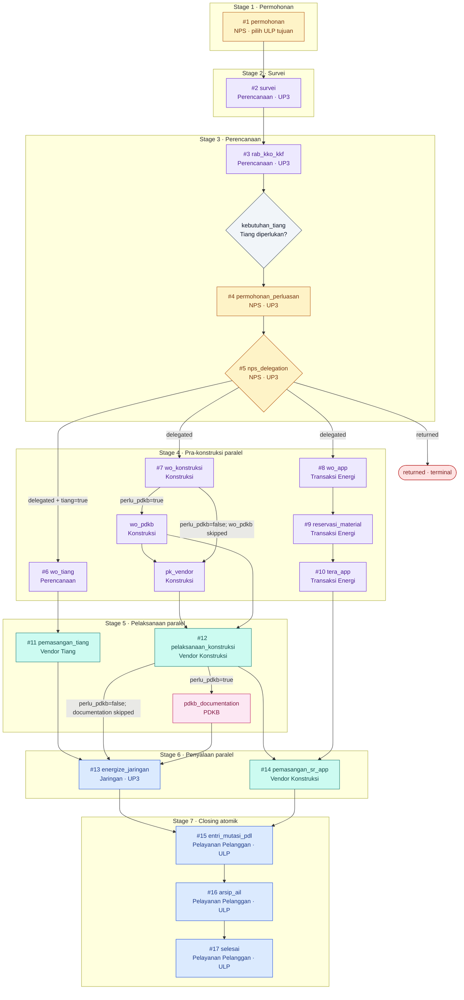

# Workflow PLG TM

**Status:** Implemented state, 9 September 2026  
**Perspektif:** PLG TM &lt;5 GWNG dan PLG TM &gt;5 GWNG

Dependency sama untuk kedua varian PLG TM; SLA-nya berbeda. Ownership awal, survei,
energize, dan SR/APP berbeda dari JTR/JTM.

Legenda warna: biru = ULP, ungu = fungsi UP3, kuning = NPS, hijau = vendor,
merah muda = PDKB, abu-abu = keputusan, merah = terminal.
