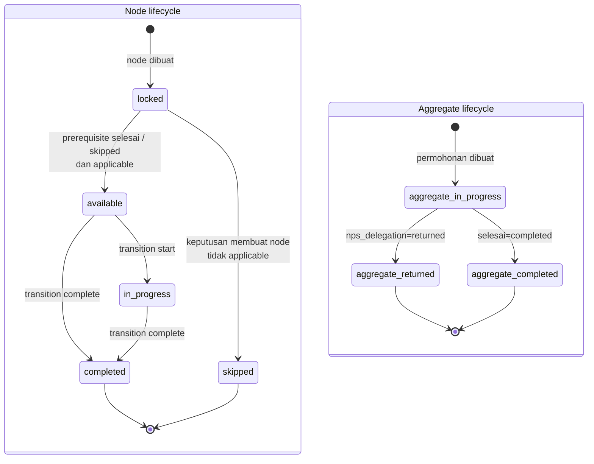

# Workflow State

**Status:** Implemented state, 9 September 2026  
**Perspektif:** Semua jenis sambungan

Status node dihitung ulang dari fakta persisted dan dependency graph. `CurrentStage`
adalah proyeksi presentasi dan bukan transition gate.

`returned` dan `completed` bersifat terminal. Node `completed` atau `skipped` dapat
memenuhi prerequisite; skip hanya sah jika condition node memang tidak applicable.
