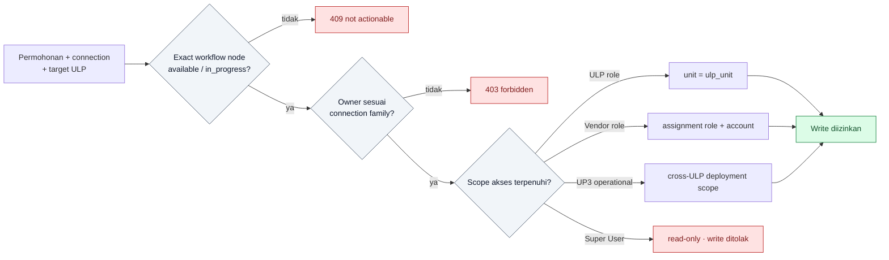

# RBAC Ownership Map

**Status:** Implemented state, 9 September 2026  
**Perspektif:** JTR/JTM dan PLG TM

Write ownership diselesaikan per workflow node. Tabel setelah diagram merangkum
perbedaan connection family; scope unit dan assignment tetap diperiksa terpisah.

| Workflow node | JTR/JTM owner | PLG TM owner | Scope tambahan |
|---|---|---|---|
| `permohonan` | pelayanan-pelanggan | nps | JTR/JTM caller ULP; PLG TM memilih target ULP |
| `survei`, `rab_kko_kkf`, `kebutuhan_tiang` | teknik | perencanaan | teknik harus matching ULP |
| `permohonan_perluasan`, `nps_delegation` | nps | nps | UP3 operational |
| `wo_tiang` | perencanaan | perencanaan | branch tiang applicable |
| `wo_konstruksi`, `wo_pdkb` | konstruksi | konstruksi | branch PDKB diperiksa per node |
| `wo_app`, `reservasi_material`, `tera_app` | transaksi-energi | transaksi-energi | UP3 operational |
| `pemasangan_tiang` | vendor-tiang | vendor-tiang | explicit vendor assignment |
| `pelaksanaan_konstruksi` | vendor-konstruksi | vendor-konstruksi | explicit vendor assignment |
| `pdkb_documentation` | pdkb | pdkb | branch PDKB applicable |
| `energize_jaringan` | teknik | jaringan | teknik harus matching ULP |
| `pemasangan_sr_app` | vendor-sr-app | vendor-konstruksi | explicit vendor assignment |
| `entri_mutasi_pdl`, `arsip_ail`, `selesai` | pelayanan-pelanggan | pelayanan-pelanggan | matching ULP |

Read scope: pelayanan-pelanggan dan teknik terbatas ULP; vendor hanya permohonan yang
ditugaskan; peran operasional UP3 dan super-user dapat membaca lintas ULP. Super-user
tidak memiliki workflow write action.
