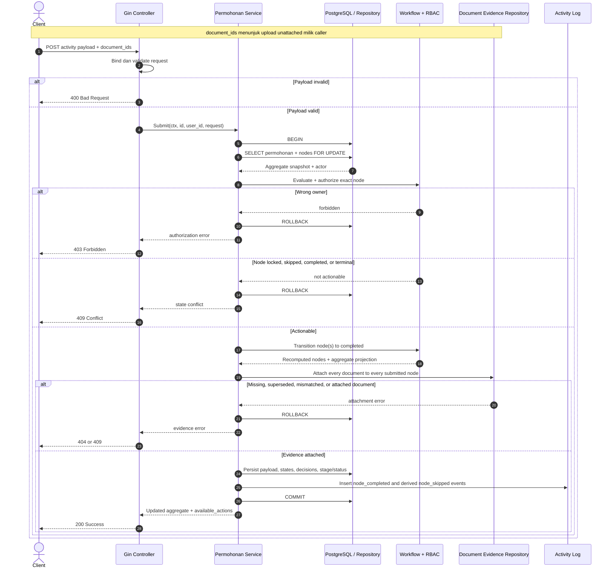

# Activity Submission Sequence

**Status:** Implemented state, 9 September 2026  
**Perspektif:** Semua endpoint penyelesaian activity

Dokumen sudah di-upload dan dipindai sebelum submission. Penyelesaian node, attachment
evidence, aggregate projection, dan audit log berada dalam satu transaksi database.

Bundled endpoints menjalankan transisi node dalam dependency order dan hanya menyimpan
hasil akhir setelah seluruh validasi berhasil.
