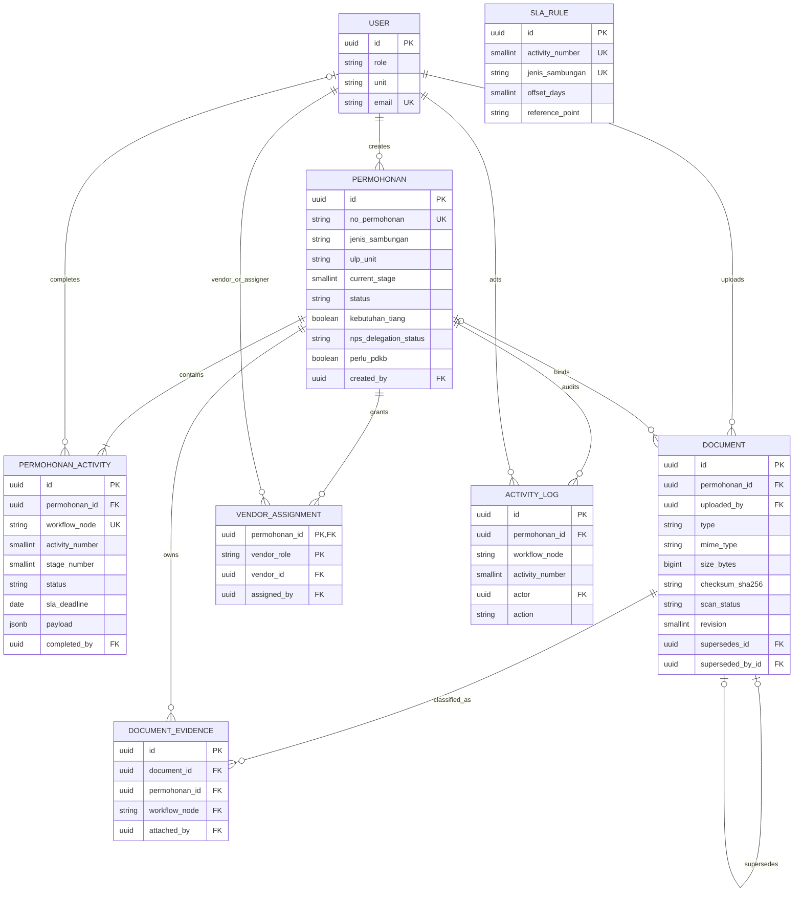

# Data Model

**Status:** Implemented state, 9 September 2026  
**Perspektif:** Entity workflow, evidence, assignment, SLA, dan audit

`SLA_RULE` dipilih secara logis memakai `(activity_number, jenis_sambungan)`; tidak ada
foreign key langsung dari workflow node. Constraint evidence memastikan dokumen dan
node berasal dari permohonan yang sama. Satu dokumen dapat menjadi evidence untuk
beberapa node melalui beberapa row `DOCUMENT_EVIDENCE`.
