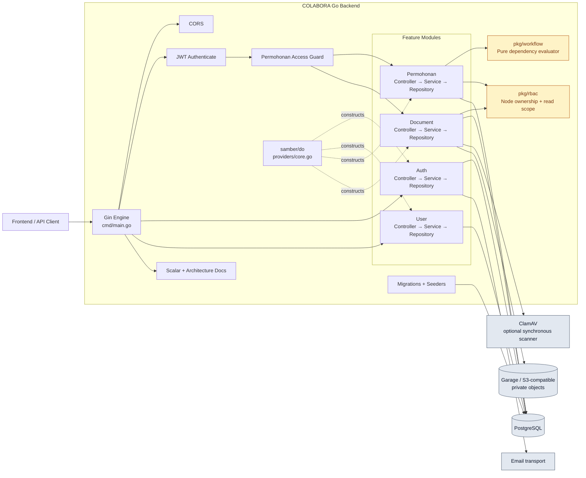

# Component Diagram

**Status:** Implemented state, 9 September 2026  
**Perspektif:** Runtime backend dan layanan eksternal

Repository menerima `*gorm.DB` atau transaksi dari service. Evaluator workflow tidak
melakukan I/O; service memegang transaction boundary dan orchestration.
