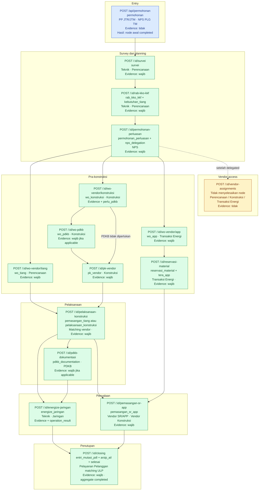

# API Action Map

**Status:** Implemented state, 9 September 2026  
**Perspektif:** Authenticated write endpoints

Path pada diagram menggunakan prefix bersama `/api/permohonan`. Setiap activity
submission mengembalikan aggregate terbaru dan caller-specific `available_actions`.
Wrong owner menghasilkan 403; node yang tidak actionable menghasilkan 409.
