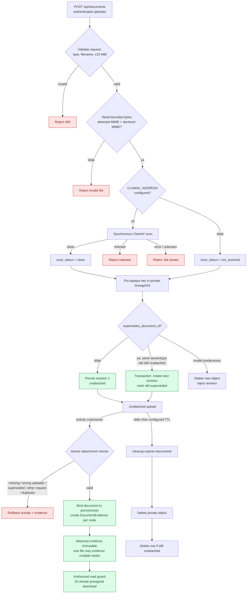

# Evidence Lifecycle

**Status:** Implemented state, 9 September 2026  
**Perspektif:** Dokumen private dan association ke workflow node

Object key, original filename, customer data, dan presigned URL tidak ditulis ke
activity log. Jika persistence upload gagal setelah object dibuat, service mencoba
menghapus object sebagai kompensasi.
