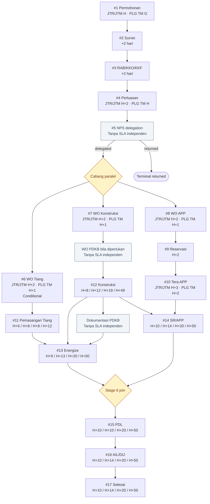

# SLA and Critical-Path View

**Status:** Implemented state, 9 September 2026  
**Perspektif:** Semua jenis sambungan

SLA adalah proyeksi dari request date dan bukan transition gate. Dependency graph
tetap menentukan node yang dapat dijalankan.

Urutan nilai yang dipisahkan `/` adalah JTR, JTM/Gardu, PLG TM &lt;5 GWNG, dan
PLG TM &gt;5 GWNG. Offset merupakan hari kalender dari request date. Runtime memakai
ambang `due soon` dua hari.
